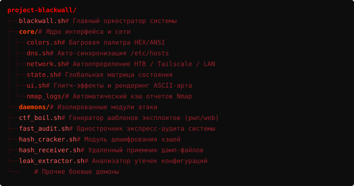
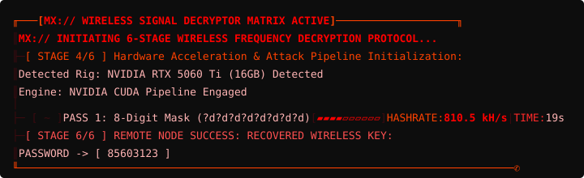
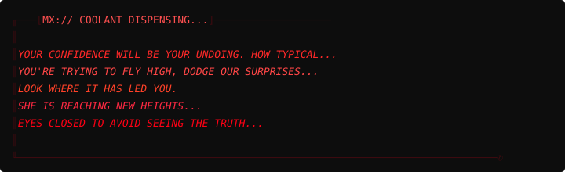
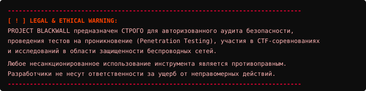

# <font color="#ff0000">░▒▓ PROJECT BLACKWALL ▓▒░</font>

> <font color="#ff5a5a">*"It is you who should be following orders, not I."*</font>

---

## <font color="#ff0037">⚡ MX:// OVERVIEW</font>

<font color="#ff0000">**PROJECT BLACKWALL**</font> — это запрещенный цифровой артефакт, вырезанный из секретных архивов лаборатории <font color="#ff0037">**Militech «Киносура» (Project Cynosure)**</font>. Инструмент представляет собой монолитную оболочку автоматизации разведывательных операций, анализа уязвимостей, беспроводного перехвата и аппаратного криптоанализа.

Проект стилизован под терминалы глубокого залегания конца XX века и интерфейсы прорыва Чёрного заслона: багровая палитра, адаптивные CRT-сканлайны, динамический спидометр хэшрейта, древовидные логи в стиле `pwndbg` и автономный голос дикого ИИ.

---

## <font color="#ff0037">☣️ MX:// MODULE CAPABILITIES</font>

Модульность системы обеспечивается изолированными демонами (`daemons/`):

| Модуль | Флаг | Описание и функции |
| :--- | :---: | :--- |
| **<font color="#ff5a5a">Recon Daemon</font>** | `-r` | Глубокое сканирование портов (`nmap`), определение сервисов и проверка на фаерволы-ловушки (SYN Proxy / Tarpit mitigation). |
| **<font color="#ff5a5a">Web Fuzzer & Meta</font>** | `-w` | Параллельный брутфорс директорий (`ffuf`), виртуальных хостов (VHOSTs), анализ SSL SAN, `robots.txt` и HTML-комментариев разработчиков. |
| **<font color="#ff5a5a">Leak Extractor</font>** | `-e` | Автоматический поиск чувствительных файлов конфигураций (`.env`, `config.php.bak`, `.git/config`) и извлечение учетных данных. |
| **<font color="#ff5a5a">Payload Generator</font>** | `-p` | Генерация оптимизированных реверс-шеллов (Bash, Base64, Python PTY) с привязкой к активным интерфейсам (HTB VPN / Tailscale / LAN). |
| **<font color="#ff5a5a">Post-Exploitation</font>** | `-d` | Локальный сервер доставки скриптов повышения привилегий (`linpeas.sh` / `winpeas.exe`) в оперативную память цели без следов на диске. |
| **<font color="#ff5a5a">Crypto Decrypter</font>** | `-c` | Автономный модуль аппаратного расшифрования хэшей через `hashcat` (MD5, SHA1, NTLM, SHA512crypt) с авто-конвертацией WSL-путей. |
| **<font color="#ff5a5a">Airwave Recon</font>** | `-S` | Беспроводной спектральный сканер (`aircrack-ng` / `airodump-ng`), автоматическое управление мощностью адаптера (20 dBm) и захват Handshake/PMKID. |
| **<font color="#ff5a5a">Wireless Decrypter</font>** | `-W` | 6-этапный конвейер взлома WPA2/WPA3 (8-значные маски, словари с правилами `best66`, мобильные префиксы, гибридные атаки). |
| **<font color="#ff5a5a">Shadow Listener</font>** | `-l` | Сервер приемника вычислительного узла (Python HTTP REST API на порту `9999`) для удаленной выгрузки дампа с Termux/ноутбука на GPU-риг. |

---

## <font color="#ff0037">📐 MX:// DIRECTORY ARCHITECTURE</font>



---

## <font color="#ff0037">🛠️ MX:// PREREQUISITES & DEPENDENCIES</font>

Для корректной работы всех подсистем Чёрного заслона требуются следующие компоненты Linux / WSL2:

### <font color="#ff4100">Основные утилиты</font>
```bash
sudo apt update && sudo apt install -y \
    nmap ffuf jq curl python3 pnetcat net-tools iproute2 searchsploit
```

### <font color="#ff4100">Беспроводной модуль (Wireless Spectrum)</font>
```bash
sudo apt install -y \
    aircrack-ng hcxtools iw wireless-tools
```

### <font color="#ff4100">Движок ускорения CUDA (WSL2 / Linux Hashcat)</font>
Для быстрого подбора паролей требуется установленный `hashcat` на хостовой машине Windows (`C:\hashcat\hashcat.exe`) или в системном `PATH`.

---

## <font color="#ff0037">🚀 MX:// INSTALLATION & SETUP</font>

1. **Клонирование репозитория:**
```bash
git clone https://github.com/avoidme12/project-blackwall.git
cd avoidme12-project-blackwall
```

2. **Настройка прав доступа:**
```bash
chmod +x blackwall.sh core/*.sh daemons/*.sh
```

---

## <font color="#ff0037">📖 MX:// USAGE GUIDE & EXAMPLES</font>

### Синтаксис запуска:
```bash
sudo ./blackwall.sh -t <IP> [ОПЦИИ]
```

### Примеры сценариев:

* **<font color="#ff5a5a">Полный комплекс разведки хоста (Recon + Web Fuzz + Leak Extraction):</font>**
  ```bash
  sudo ./blackwall.sh -t 10.129.248.117 -n paperwork -r -w -e
  ```

* **<font color="#ff5a5a">Генерация реверс-шеллов и запуск сервера доставки LinPEAS:</font>**
  ```bash
  sudo ./blackwall.sh -t 10.129.248.117 -p -d
  ```

* **<font color="#ff5a5a">Беспроводное сканирование эфира и перехват Handshake:</font>**
  ```bash
  sudo ./blackwall.sh -S
  ```

* **<font color="#ff5a5a">Запуск автономного узла вычислений (Shadow Listener на GPU-сервере):</font>**
  ```bash
  sudo ./blackwall.sh -l
  ```

---

## <font color="#ff0037">☣️ MX:// TERMINAL PREVIEW & AI LOGS</font>



При перегреве вычислений и смене фаз GPU автоматически запускаются протоколы терморегуляции:



---

## <font color="#ff0037">⚠️ MX:// DISCLAIMER</font>



---

<p align="center">
  <sub><font color="#ff2244">PROJECT BLACKWALL // CYNOSURE MILITECH ARCHIVES // 2026</font></sub>
</p>
